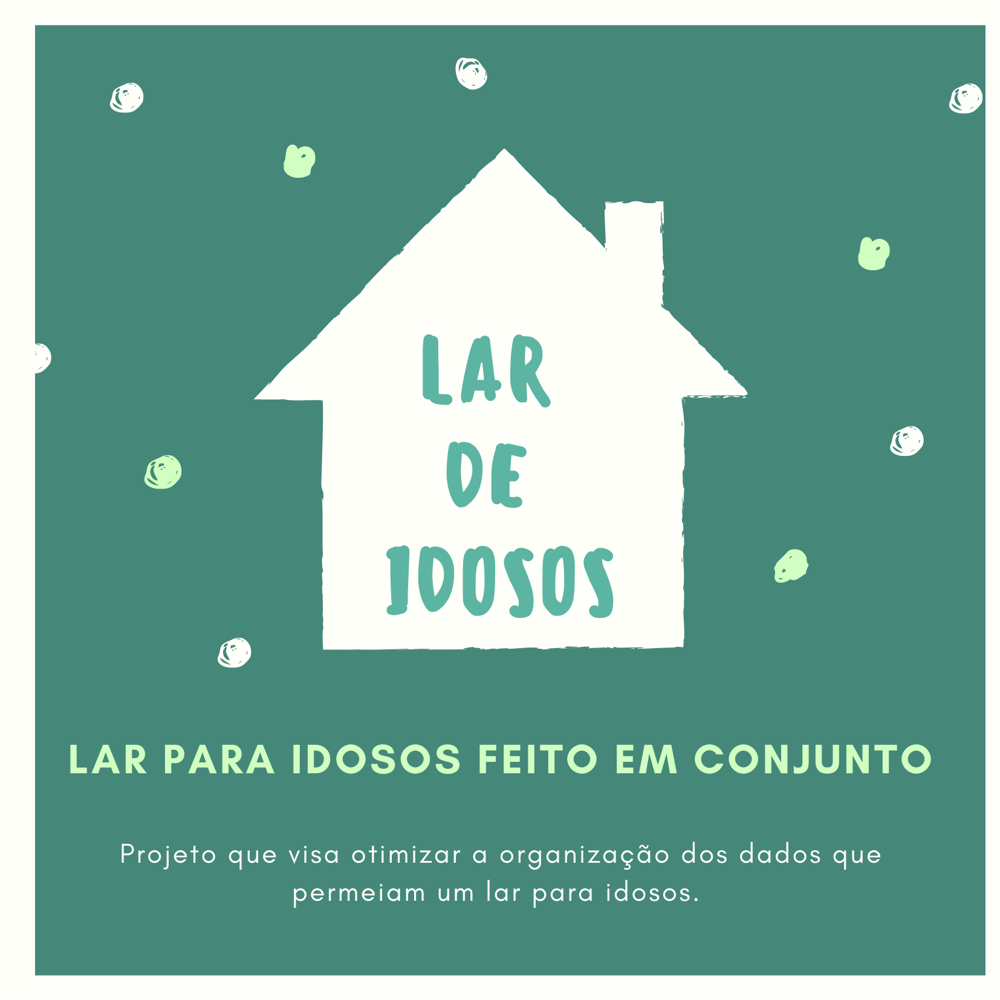
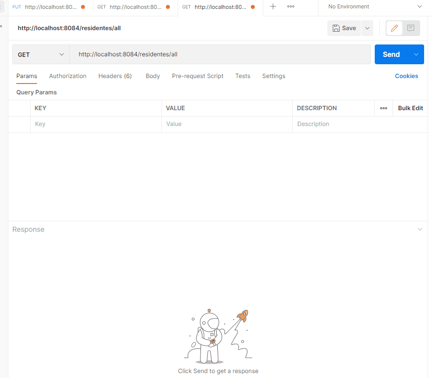
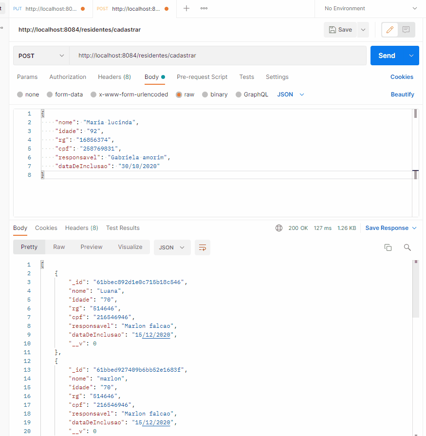
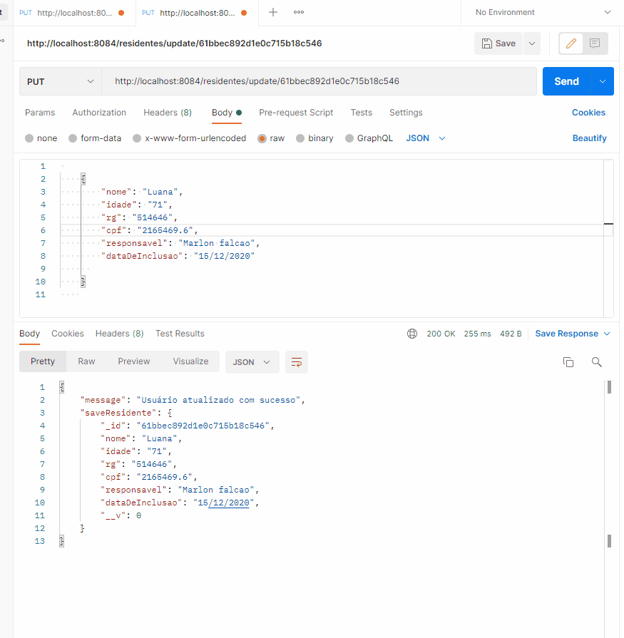
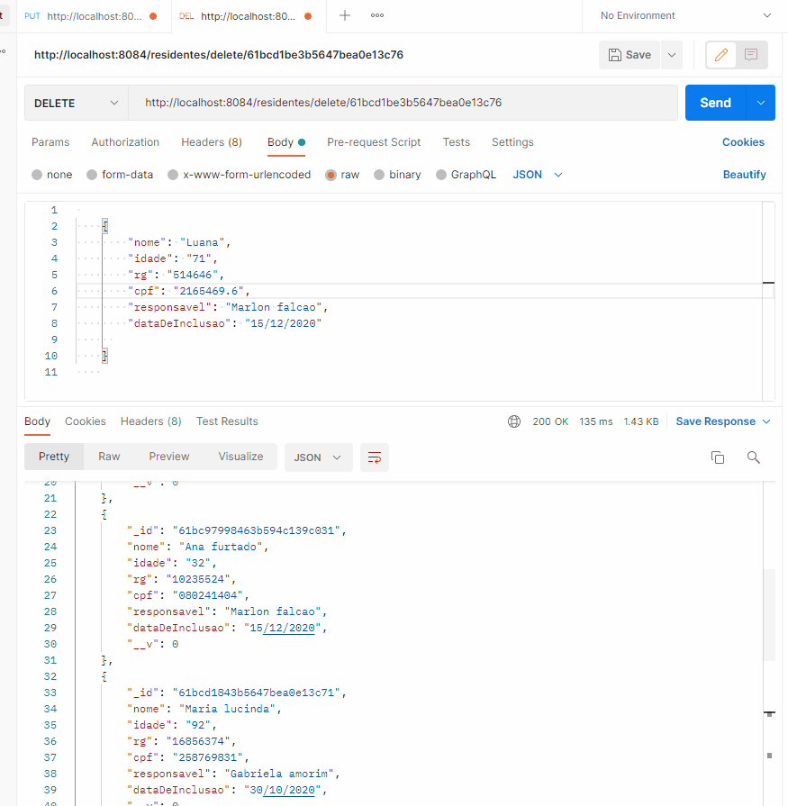

<h1 align="center"> Reprograma - projeto para Lar de Idosos </h1>





## Sumário  


* [Apresentação](#apresentação)
* [Funcionalidades](#funcionalidades)
* [Aprendizados](#aprendizados)
* [Tecnologias utilizadas](#tecnologias-utilizadas)
* [Arquitetura MVC](#arquitetura-mvc)
* [Como rodar o projeto](#como-rodar-o-projeto)
* [Rotas](#rotas)
* [Referências](#referencias)
* [Conclusão](#conclusao)


## 💻 Apresentação

<br>

<p align="justify">API desenvolvida como projeto final para conclusão do bootcamp de Backend da {Reprograma}. 

<p align="justify">Sempre tive uma ligação com pessoas idosas, parte disso por ter sido criada pela minha avó, então surgiu a vontade de criar esse projeto em prol de ajudar instituições, casas para idosos, que no seu dia dia dependam de ajuda voluntária e de doações. 

<p align="justify">Essa API visa otimizar a organização dos dados das instituições, levando mais segurança por meio dos registros dos idosos residentes, resposáveis, funcionários, voluntários da casa e visitantes. 


<br><br>


## 🔗 Link


<br><br>

## ⚙️ Funcionalidades

- Cadastro dos idosos residentes, seus responsáveis, funcionários, voluntário e visitantes;
- Registro dos horários e data de visita;
- Registro do horários dos funcionários e voluntários;
- Simplificar o dia a dia da instituição levando segurança aos que moram e trabalham nela;

<br><br>

## 📚 Aprendizados

<p align="justify"> Este projeto final consiste em uma API fundamentada no CRUD, integrado com o banco de dados. Nela podemos listar os funcionários, idosos, responsáveis por esses idosos, por exemplo, cadastrar, atualizar e deletar cadastros.

- Definição CRUD: 
    
      CREATE (CRIAR)
      READ (LER)
      UPDATE (ATUALIZAR) 
      DELETE (DESTRUIÇÃO)


<br><br>


## 🛠️ Tecnologias Utilizadas


<p  align="justify">
<a  href="https://www.javascript.com/">
<a  href="https://git-scm.com/">
<a  href="https://nodejs.org/pt-br/">
<a  href="https://www.mongodb.com/cloud/atlas">
<a  href="https://www.postman.com/">
<a  href="https://code.visualstudio.com/">
<a  href="https://dashboard.heroku.com/apps">
<a  href=""></a>


### Bibliotecas Aplicadas

<p  align="justify">
<a  href="https://expressjs.com/pt-br/">
<a  href="https://www.npmjs.com/package/nodemon">
<a  href="https://www.npmjs.com/package/dotenv-safe">
<a  href="https://mongoosejs.com/">
<a  href="https://www.npmjs.com/package/cors">
<a  href="https://www.npmjs.com/">

<br>


## 📁 Arquitetura MVC

```
 📁 reprograma_lar_de_idosos
   |
   |-  📁 src
   |    |
   |    |- 📁 controller
   |         |- 📑 residentesControllers.js
   |         |- 📑 funcionariosControllers.js
   |         |- 📑 voluntariosControllers.js 
   |         |- 📑 responsaveisControllers.js 
   |         |- 📑 visitantesControllers.js 
   |
   |    |- 📁 database
   |         |- 📑 mongoConfig.js
   |
   |    |- 📁 models
   |         |- 📑 funcionariosSchema.js
   |         |- 📑 residentesSchema.js
   |         |- 📑 responsaveisSchema.js
   |         |- 📑 visitantesSchema.js
   |         |- 📑 voluntariosSchema.js
   |
   |    |- 📁 routes
   |         |- 📑 index.js 
   |         |- 📑 funcionariosRoutes.js 
   |         |- 📑 residentesRoutes.js 
   |         |- 📑 responsaveisRoutes.js 
   |         |- 📑 voluntatiosRoutes.js 
   |         |- 📑 visitantesRoutes.js 
   |
   |    |- 📑 app.js
   |    |- 📑 swagger.json
   |
   |
   |- 📑 .env
   |- 📑 .env.example
   |- 📑 .gitignore
   |- 📑 LICENSE
   |- 📑 package-lock.json
   |- 📑 package.json
   |- 📑 README.md
   |- 📑 server.js

```
<br>


## ⚙️ **Instruções para Instalação**

- Faça um `fork` do projeto através do link (<https://github.com/kamilaaliima/reprograma_lar_de_idosos/fork>);

- Copie o código do _fork_ realizado e, no Git Bash Here da sua máquina, realize o clone do projeto através do `git clone <link_do_fork_do_repositorio>`;

- Crie uma _branch_ para realizar suas contribuições `git checkout -b feature/<sua_branch>`;

- Entre na pasta da API Lar De Idosos;

- Instale as dependências necessárias à execução da API através do comando `npm install`;

- Para executar a API, utilize o comando `npm start` no seu terminal;

- Caso faça contribuições no projeto, realize o _commit_ com o comando `git commit -m 'sua mensagem'`;

- Para subir o projeto no seu GitHub, basta executar o comando `git push origin feature/<sua_branch>`;

- E finalize solicitando um _Pull Request_ com as contribuições para o projeto original.


## 🔃 **Rotas**

Esta API está sendo escutada na `porta 8084`.


## 🚪 Portas

* local: http://localhost:8084

## Opções de Portas

* Local: http://localhost:8084 - (rodando localmente)

* Heroku: https://reprograma-lar-de-idoso.herokuapp.com/- (consumir API)
* Heroku:

    * Utilize o [Postman](https://www.postman.com/) ou [Insomnia](https://insomnia.rest/download/) para para chamar e testar os endpoints da API localmente ou via Heroku

<br>

### 🔃 Retorna teste com apresentação 

| Método HTTP  | Tipo Rota | Endpoint                     | Descrição                            |
| ------------ | --------- | ---------------------------- | ------------------------------------ |
| GET          | Pública   | `http://localhost:8084/`     |  Mensagem de apresentação (Index)    |             

<br>


## 🔃 Manipulação das Rotas de residentes:

| Método HTTP  | Endpoint                | Descrição                            |
| ------------ | ----------------------- | ------------------------------------ |
| GET          | `/residentes`           | Retorna todos residentes             |
| GET          | `/nome`                 | Retorna residente específico por nome    
| GET          | `//:id`          | Retorna residente específico por id      |
| POST         | `//cadastrar`    | Cria/cadastra um residente novo           |
| PUT          | `//:id`          | Altera informações de um residente       |
| DELET        | `//:id`          | Remove um residente específico           |

<br>

## 🔃 Manipulação das Rotas de Funcionários:

| Método HTTP  | Endpoint                | Descrição                            |
| ------------ | ----------------------- | ------------------------------------ |
| GET          | `/funcionários`           | Retorna todos funcionários             |
| GET          | `/nome`                 | Retorna residente específico por nome    
| GET          | `//:id`          | Retorna funcionários específico por id      |
| POST         | `//cadastrar`    | Cria/cadastra um funcionário novo           |
| PUT          | `//:id`          | Altera informações de um funcionário      |
| DELET        | `//:id`          | Remove um funcionário específico           |

<br>

## 🔃 Manipulação das Rotas de Responsáveis:

| Método HTTP  | Endpoint                | Descrição                            |
| ------------ | ----------------------- | ------------------------------------ |
| GET          | `/responsáveis`           | Retorna todos responsáveis             |
| GET          | `/nome`                 | Retorna responsável específico por nome    
| GET          | `//:id`          | Retorna responsável específico por id      |
| POST         | `//cadastrar`    | Cria/cadastra um responsável novo           |
| PUT          | `//:id`          | Altera informações de um responsável       |
| DELET        | `//:id`          | Remove um responsável específico           |

<br>

## 🔃 Manipulação das Rotas de Voluntários:

| Método HTTP  | Endpoint                | Descrição                            |
| ------------ | ----------------------- | ------------------------------------ |
| GET          | `/responsáveis`           | Retorna todos voluntários             |
| GET          | `/nome`                 | Retorna voluntário específico por nome    
| GET          | `//:id`          | Retorna voluntário específico por id      |
| POST         | `//cadastrar`    | Cria/cadastra um voluntário novo           |
| PUT          | `//:id`          | Altera informações de um voluntário       |
| DELET        | `//:id`          | Remove um voluntário específico           |

<br>

## 🔃 Manipulação das Rotas de Visitantes:

| Método HTTP  | Endpoint                | Descrição                            |
| ------------ | ----------------------- | ------------------------------------ |
| GET          | `/visitantes`           | Retorna todos voluntários             |
| GET          | `/nome`                 | Retorna visitante específico por nome    
| GET          | `//:id`          | Retorna visitante específico por id      |
| POST         | `//cadastrar`    | Cria/cadastra um visitante novo           |
| PUT          | `//:id`          | Altera informações de um visitante       |
| DELET        | `//:id`          | Remove um visitante específico           |

<br>

## **Teste Manual**

Demonstração das etapas do CRUD , realizada no <a href="https://www.postman.com/">Postman</a>:

Get /All -
<h1 align="center">

<p align="center"><p>
</h1>

Get /nome - 
<h1 align="center">

<p align="center"><p>
</h1>

Get /ById - 
<h1 align="center">

<p align="center"><p>
</h1>

Post /cadastrar - 
<h1 align="center">

<p align="center"><p>
</h1>

Put /update/id - 
<h1 align="center">

<p align="center"><p>
</h1>

Delet /delte/id - 
<h1 align="center">

<p align="center"><p>
</h1>

<br>

## 📌 **Melhorias Futuras**

<br>

* Criar dependência entre Responsável e Residente por meio do Id.
* Criar segurança por meio de login para acesso a lista de dados. 

Esse projeto está em construção 🚧, caso você tenha uma sugestão de melhorias para ele, ela será bem vinda! 🌼

<br>

## 📑 **Referências**

<h3>

> <a href="https://www.alura.com.br/artigos/escrever-bom-readme?utm_source=ActiveCampaign&utm_medium=email&utm_content=Portf%C3%B3lio%2C+Empregos+e+Aprendizagem&utm_campaign=%5BIMERS%C3%95ES%5D+%28Newsletter%29+%2338&vgo_ee=oGslBA5OCYzH0ORk0CMq9WqikUYh8M8BxFvwW49kncI%3D">Como escrever um README incrível no seu Github</p></a>

 > <a href="https://github.com/elisabetealves/reprograma-estante-de-historias"><p align="">Inspiração Readme - Elisabete Alves</p></a>

  > <a href="https://github.com/priscilaestevao/pretitudes-project-reprograma"><p align="">Inspiração Readme - Priscila Estevão </p></a> 

  > <a href="https://github.com/xeniabarreto/FarmaBem.git"><p align="">Inspiração Readme - Xênia Barreto </p></a> 

</h3>

<br>

### Autora
<br>

<h1 align="center">
  
</h1>

<br>

</h1>
Kamila Lima 
🧡 
</h1>

<br>

  <div>
    <a href="https://www.linkedin.com/in/kamila-lima-14299b150/" target="_blank"></a>  
  <a href = "https://github.com/kamilaaliima"></a>
   <a href = "mailto:kamilalimame@gmail.com"></a>
   
 </div>
  

<br>


    
    
